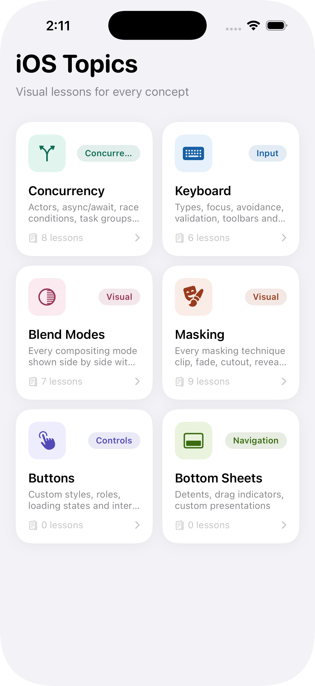
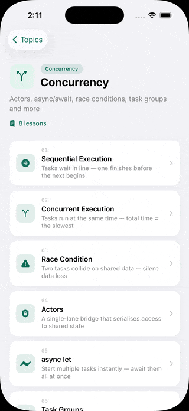
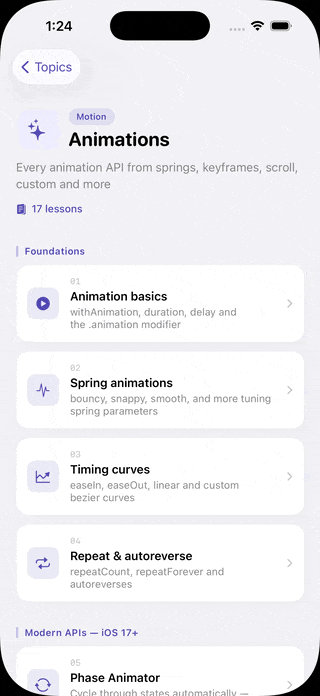
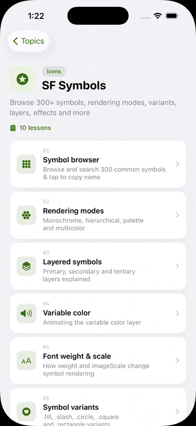
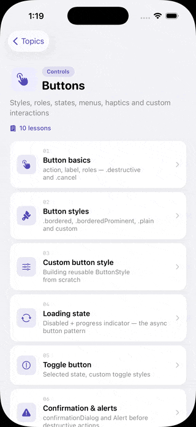
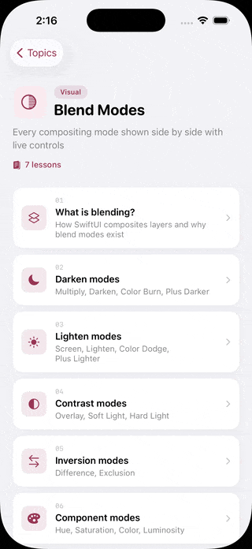
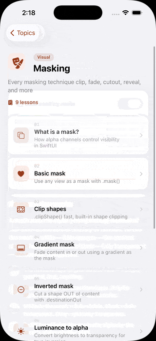
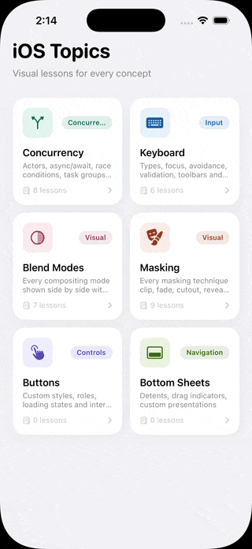

<br/>

> **iOS development, Shown - not told.**

ShowUI is an interactive learning app for iOS developers. Every concept has its own lesson. Every lesson has a live, tappable visual at the top. No slides. No passive reading. You tap, drag, toggle, and watch it happen in real time.

## Screenshots

<table>
  <tr>
    <td width="25%"></td>
    <td width="25%"></td>
    <td width="25%"></td>
    <td width="25%"></td>
  </tr>
  <tr>
    <td width="25%"></td>
    <td width="25%"></td>
    <td width="25%"></td>
    <td width="25%"></td>
  </tr>
</table>

## What's inside

57 lessons across 7 topics. Every one built to be felt, not just read.

| Topic | Lessons | Highlights |
|---|:---:|---|
| **Concurrency** | 8 | Race conditions you can trigger, actors with a lock animation, live task cancellation |
| **Animations** | 17 | Springs, keyframes, phase animator, scroll effects, TimelineView particles, GeometryEffect |
| **SF Symbols** | 10 | Searchable browser with 300+ symbols, rendering modes, variable color, layer toggle |
| **State & Binding** | 8 | How SwiftUI views own, share and react to data changes |
| **Navigation Stack** | 8 | Typed navigation, paths, deep linking, toolbars and split views |
| **Keyboard** | 6 | Every keyboard type, focus chaining, avoidance modes side by side |
| **Masking** | 9 | Clip shapes, gradient fade, inverted mask, animated reveal, path mask |
| **Blend Modes** | 7 | All 20 blend modes with live color picker and category breakdown |
| **Buttons** | 10 | Loading states, toggle patterns, menus, haptics, custom styles, hit testing |
| **Bottom Sheets** | 9 | Detents, drag indicators, background interaction and more |

## Lesson Structure

```
┌─────────────────────────────────┐
│                                 │
│   Interactive visual            │  ← tap it, drag it, trigger it
│   (always at the top)           │
│                                 │
├─────────────────────────────────┤
│                                 │
│   Plain-language explanation    │  ← what's happening and why
│                                 │
├─────────────────────────────────┤
│                                 │
│   func path(in rect: CGRect)    │  ← the actual Swift, no boilerplate
│       → Path { ... }            │
│                                 │
└─────────────────────────────────┘
```

> Every lesson follows this structure. The visual comes first you form an intuition before you read the explanation. The code at the bottom is copy paste ready.


## Built for all levels

ShowUI isn't just for beginners. The Animations topic covers `KeyframeAnimator`, `GeometryEffect`, `TimelineView`, `DrawingGroup`, and `Transaction`. APIs that most experienced developers haven't fully explored. The SF Symbols topic has a full searchable browser and covers `variableValue:`, layered rendering modes, and custom symbol import.

If you already know SwiftUI, you'll still find something new.

## Contributing

Found a bug? Have a topic idea? Open an issue or submit a pull request. If you can write a SwiftUI view, you can add a lesson.

## License

This project is source available. See the LICENSE file for full details.